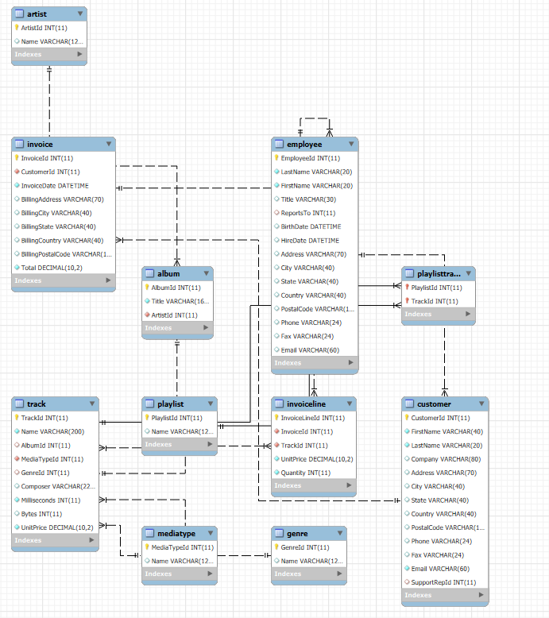
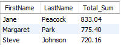
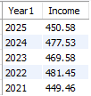
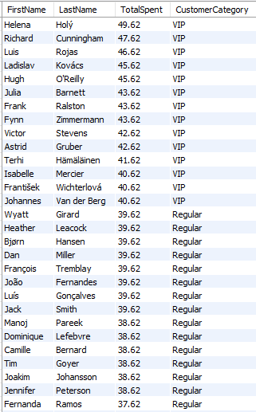
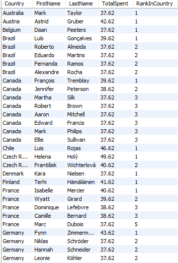
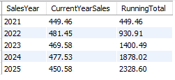

# Digital Music Store Analysis (SQL)

## Project Overview
This project involves an analysis of a digital music store database (**Chinook**). I used **SQL (MySQL)** to answer questions regarding sales performance, customer demographics, and employee efficiency.

The project demonstrates the ability to query relational databases, perform complex joins, calculate aggregations, and implement business logic.

* **Database:** Chinook (MySQL version)
* **Tools:** MySQL Workbench
* **Key Skills:** Complex Joins, Aggregations, Conditional Logic (`CASE WHEN`), Date Functions, Filtering.

---

### Database Schema:




## Key Problems & Solutions


### 1. Employee Performance Evaluation 
**Problem:** top-performing Sales Support Agent based on the total revenue generated from their assigned customers.

```sql 
SELECT employee.FirstName, employee.LastName, SUM(Invoice.Total) AS Total_Sum
FROM employee JOIN Customer ON employee.EmployeeId = Customer.SupportRepId 
JOIN invoice ON customer.CustomerId = invoice.CustomerId
GROUP BY employee.FirstName, employee.LastName 
ORDER BY Total_Sum DESC;
```

**Query Result:**  




### 2. Sales Trends Over Time 
**Problem:** How has the company's revenue performed year-over-year?

```sql
SELECT 
    YEAR(InvoiceDate) AS SalesYear, 
    SUM(Total) AS TotalRevenue
FROM Invoice
GROUP BY YEAR(InvoiceDate)
ORDER BY SalesYear DESC;
```

**Query Result:**  




### 3. Customer Segmentation (VIPs) 
**Problem:** categorized customers based on their spending habits to introduce a loyalty program. 

VIP: Spent > $40

Regular: Spent > $20

New: Spent <= $20

```sql
SELECT customer.FirstName, customer.LastName, SUM(invoice.Total) AS TotalSpent,
CASE 
	WHEN SUM(invoice.Total)  > 40 THEN 'VIP'
    WHEN SUM(invoice.Total)  > 20 THEN 'Regular'
    ELSE 'New'
END AS CustomerCategory
FROM customer JOIN invoice ON customer.CustomerId = invoice.CustomerId
GROUP BY customer.CustomerId , customer.FirstName, customer.LastName
ORDER BY TotalSpent DESC;
```

**Query Result:**  




### 4. Best Clients in each Country
**Problem:** top-spending customer in each country.

```sql
WITH CustomerCountrySales AS (
    SELECT 
        c.Country, c.FirstName, c.LastName, SUM(i.Total) as TotalSpent
    FROM customer c
    JOIN invoice i ON c.CustomerId = i.CustomerId
    GROUP BY c.Country, c.FirstName, c.LastName
)
SELECT 
    Country, FirstName, LastName, TotalSpent, 
    RANK() OVER (PARTITION BY Country ORDER BY TotalSpent DESC) AS RankInCountry
FROM CustomerCountrySales
WHERE TotalSpent > 0;
```

**Query Result:**  




### 5. Cumulative Sales Growth (Running Total) 
**Problem:** The cumulative growth of revenue over the years.

```sql
WITH YearlySales AS (
    SELECT 
        YEAR(InvoiceDate) AS SalesYear, 
        SUM(Total) AS CurrentYearSales
    FROM Invoice
    GROUP BY YEAR(InvoiceDate)
)
SELECT 
    SalesYear, 
    CurrentYearSales, 
    SUM(CurrentYearSales) OVER (ORDER BY SalesYear) AS RunningTotal
FROM YearlySales;
```

**Query Result:**  




### 📂 Files in this Repository
***Chinook_Analysis.sql*** - The complete source code file containing all queries.


***Chinook_MySql.sql*** - The complete Chinook database.


***Outputs*** - Folder containg the screenshots of the results.


***Schema*** - Chinook database schema.


